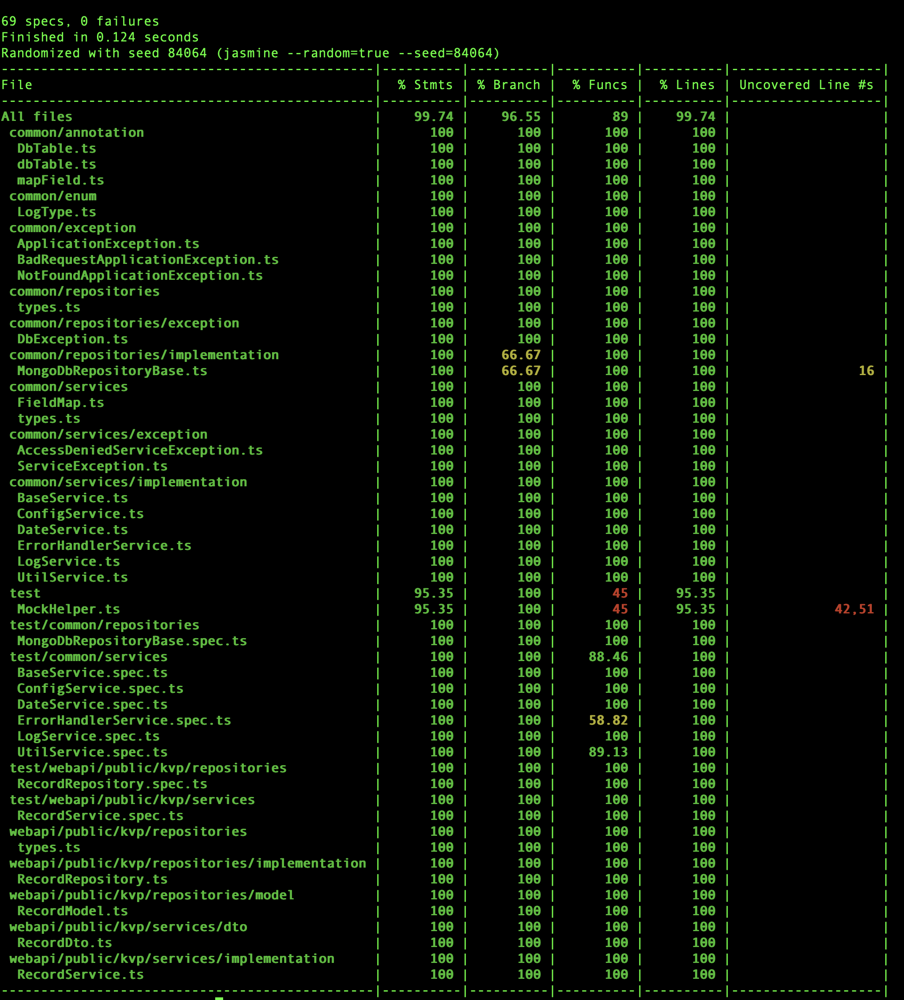
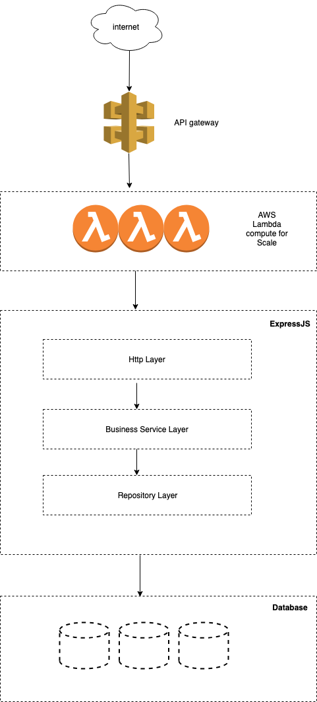

# Data Store
extensible Datastore that can support sharding using name space

## Tools/Technologies use
* [Typescript](https://www.typescriptlang.org/ "link title")
* [Serverless Framework](https://serverless.com/ "link title")
* [Serverless Offline](https://github.com/dherault/serverless-offline "link title")
* [Inversion Of Control](http://inversify.io/ "link title")
* [Jasmine Unit Test](https://jasmine.github.io/ "link title")
* [Nyc Test Coverage Framework](https://github.com/istanbuljs/nyc "link title")
* [ExpressJS](https://expressjs.com/ "link title")
* [Webpack](https://webpack.js.org/ "link title")
* [MongoDB](https://www.mongodb.com/ "link title")
* [AWS Vpc](https://aws.amazon.com/vpc/ "link title")
* [AWS Cloud Formation](https://aws.amazon.com/cloudformation/ "link title")
* [AWS Api Gateway](https://aws.amazon.com/api-gateway/ "link title")
* [AWS Lambda](https://aws.amazon.com/lambda/ "link title")
* [AWS Cloudwatch](https://aws.amazon.com/cloudwatch/ "link title")
* [Layer Architecture](https://en.wikipedia.org/wiki/Multitier_architecture "link title")
* [ngrok - local testing service expose to public](https://ngrok.com/ "link title")

## Getting Started
These instructions will get you a copy of the project up and running on your local machine for development and testing purposes. See deployment for notes on how to deploy the project on a live system.

* install [Serverless Framework](https://serverless.com/ "link title")
* git clone the from to you local drive
* install mongodb without password for easy running locally or if password is needed, update the infra/parameter/<stage (local/dev/uat/prod)>.json mongodb->connectionString
* git clone the project
* go to project root directory
* npm install , this will common lib
* npm test, this will run the test to make sure the app is in good state
* goto webapi/public/kvp
* execute npm install, this will install lib particular to the project
* to run locally execute npm start

## to check test coverage
```
npm test
```



## Endpoints Request Sample

endpoint format  : http://[host]:[port]/[workspace]/[key]/[version]?=timestamp=[version]

* workspace : this is use to segregate each records of keys under a separate workspace. This functionality is useful if we want to put together related records under one folder/name/workspace. Under multi tenancy situation this functionality is also useful.
* key: record key
* version: this is for versioning purpose of the data. No data will be overwritten, every update is a new record. This behavior is also good since this is faster then searching the record and updating it.


```
# key is part of the body
POST http://localhost:5000/employees
{
    "key1": {
        "name": "employe 1",
        "address": "singapore"
    }
}

# key is part of the url so that payload is only about the value
POST http://localhost:5000/employees/key1
{    
    "name": "employe 1",
    "address": "singapore"
}
# response
{
    "timestamp": 1553367597,
    "value": {
        "name": "employe 1",
        "address": "singapore"
    },
    "key": "key1"
}

# if version is not supplied, it will return only the latest data
GET http://localhost:5000/employees/key1
{
    "key1": {
        "name": "employe 1",
        "address": "singapore"
    }
}

# if version is supplied using query params
GET http://localhost:5000/employees/key1?timestamp=1553367597
{
    "key1": {
        "name": "employe 1",
        "address": "singapore"
    }
}

# version is supplied using rest style
GET http://localhost:5000/employees/key1/1553367597
{
    "key1": {
        "name": "employe 1",
        "address": "singapore"
    }
}

```

## how to deploy to Cloud Provider
```
make sure the aws commandline tools is properly setuo by following instruction from https://docs.aws.amazon.com/cli/latest/userguide/cli-chap-configure.html

# goto webapi/public/kvp
sls deploy -s prod
```

## why use Layer Architecture
This arhitecture is use so that to minimize the effect of changing one to component. For example currently we are using MongoDB as our data store and in later time should we decide to use couchdb or mysql. We only have to update Repository Layer and the rest of the component don't needed to be updated.



## Todo List - For improvement
* currently it's running in the macbook pro with [ngrok](https://ngrok.com/ "link title") as proxy to make it public. So performance is minimal. This approach is choosen since a lot of components from AWS is use in this project to demonstrate a real life setup. But deploying it might fall under free tier anymore.
* Repository Layer should use the "workspace" as physical partitioning so that those workspace that is huge amount of records will not affect others
* use redis/memcache for caching